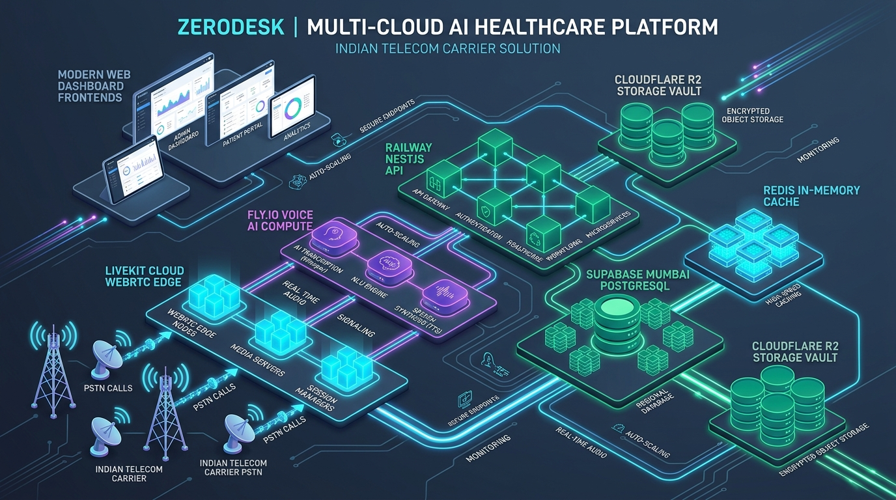
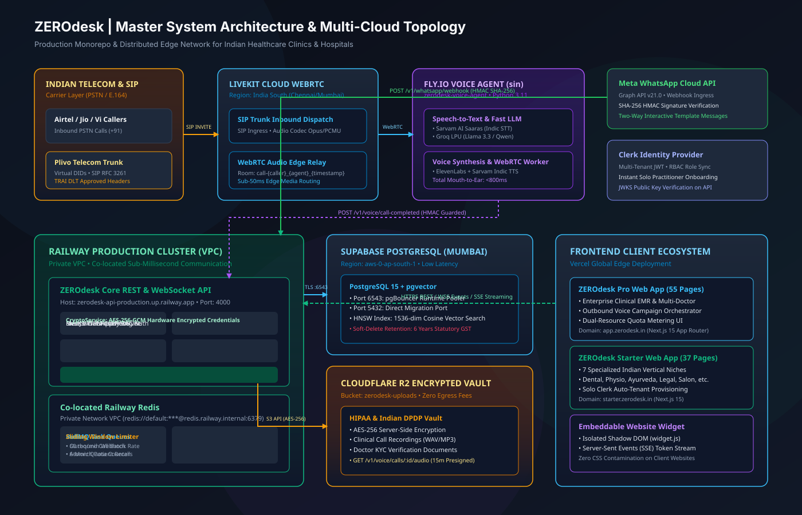
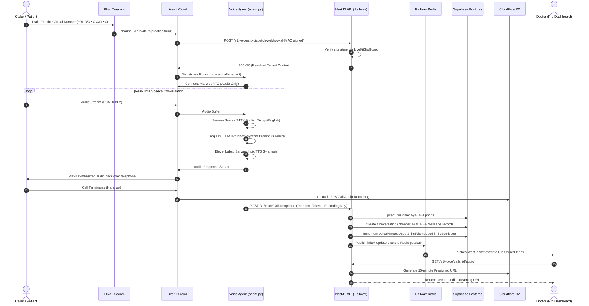

# 01. Master System Architecture & Cloud Infrastructure Topology

## 1. Executive Summary

ZEROdesk is an enterprise multi-tenant AI operations platform designed for Indian healthcare clinics, hospitals, and high-velocity service businesses. The platform bridges real-time telephony (PSTN/SIP), omnichannel messaging (WhatsApp), and clinical SaaS workflows with sub-second response times and statutory compliance.

This document details the complete end-to-end system architecture, cloud deployment topology, network boundaries, and inter-service authentication mechanisms.

---

## 2. Cloud Infrastructure Topology

### 🖼️ Master Infrastructure Infographic


### 📐 Technical Vector Topology (SVG)


### 🗺️ Infrastructure Node Graph
```mermaid
flowchart TD
    subgraph Telecom["Indian Telecom Carriers (PSTN)"]
        Airtel["Airtel / Jio Subscribers"]
        PlivoCarrier["Plivo Telecom Carrier Network<br/>(Virtual DIDs + SIP Trunking)"]
        Airtel -->|E.164 Inbound Call| PlivoCarrier
    end

    subgraph EdgeOrchestration["Real-Time Audio & WebRTC Edge"]
        LiveKitCloud["LiveKit Cloud Orchestrator<br/>(wss://zerodesk-rpjledlb.livekit.cloud)<br/>• SIP Trunk Dispatch<br/>• WebRTC Media Routing<br/>• India South Region"]
        PlivoCarrier -->|SIP Invite (RFC 3261)| LiveKitCloud
    end

    subgraph FlyCompute["Fly.io Cloud Compute (Singapore sin)"]
        VoiceAgent["LiveKit Voice Agent Worker<br/>(zerodesk-voice-agent)<br/>• Python 3.11 Stateful Process<br/>• Sarvam AI Saaras (Indic STT)<br/>• Groq LPU (Qwen / Llama 3.3)<br/>• ElevenLabs & Sarvam (TTS)<br/>• WebRTC Media Receiver"]
        LiveKitCloud <-->|Low-Latency WebRTC Stream| VoiceAgent
    end

    subgraph RailwayCluster["Railway Cloud Production Cluster"]
        CoreAPI["ZEROdesk Core REST & WebSocket API<br/>(zerodesk-api-production.up.railway.app)<br/>• NestJS 11 + Fastify/Express<br/>• Prisma ORM v6<br/>• Port 4000<br/>• HMAC & Tenant Guards"]
        
        RailwayRedis["Railway Redis Database<br/>• In-Memory BullMQ Queues<br/>• Sub-Millisecond VPC Latency<br/>• Outbound Call Job Distribution<br/>• Sliding-Window Rate Limiting"]
        
        CoreAPI <-->|Private Network (0ms)| RailwayRedis
    end

    subgraph SupabaseDB["Supabase Managed Database (Mumbai ap-south-1)"]
        PostgresDB["PostgreSQL 15 + pgvector<br/>• Port 6543 (pgBouncer Connection Pooler)<br/>• Port 5432 (Direct Migration Port)<br/>• Multi-Tenant Row Scoping (tenant_id)<br/>• HNSW Vector Similarity Index"]
        CoreAPI <-->|Encrypted TLS (Port 6543)| PostgresDB
    end

    subgraph CloudflareVault["Cloudflare R2 Object Storage"]
        R2Bucket["Cloudflare R2 Storage Vault<br/>(zerodesk-uploads)<br/>• AES-256 Encrypted Clinical Audio<br/>• KYC Medical Registration Proofs<br/>• 15-Minute Presigned Download URLs"]
        CoreAPI <-->|AWS S3 SDK v3| R2Bucket
    end

    subgraph ClientFrontends["Vercel Cloud Edge Frontends"]
        ProFrontend["ZEROdesk Pro Web App<br/>(app.zerodesk.in)<br/>• Next.js 15 App Router<br/>• 55 Specialized Dashboard Pages<br/>• Live WebSocket Inbox Streaming"]
        
        StarterFrontend["ZEROdesk Starter Web App<br/>(starter.zerodesk.in)<br/>• Next.js 15 App Router<br/>• 37 Specialized Niche Pages<br/>• Optimistic UI + Local Caching"]
        
        WebsiteWidget["Embeddable Website Chatbot<br/>(widget.js)<br/>• Shadow DOM Injection<br/>• SSE Token Streaming"]
    end

    subgraph IdentityMeta["Third-Party Authentication & Meta Edge"]
        ClerkAuth["Clerk Identity Provider<br/>• Multi-Tenant JWT Tokens<br/>• Solo Practitioner Fallback"]
        MetaGraph["Meta WhatsApp Cloud API<br/>• Graph API v21.0<br/>• Webhook WebSub Callbacks"]
    end

    %% Inter-Service Communication
    VoiceAgent -->|POST /v1/voice/call-completed<br/>x-internal-voice-key| CoreAPI
    MetaGraph -->|POST /v1/whatsapp/webhook<br/>SHA-256 HMAC Signature| CoreAPI
    LiveKitCloud -->|POST /v1/voice/sip-dispatch-webhook<br/>LiveKit WebhookReceiver HMAC| CoreAPI
    
    ProFrontend -->|HTTPS REST & WS| CoreAPI
    StarterFrontend -->|HTTPS REST| CoreAPI
    WebsiteWidget -->|SSE / REST| CoreAPI
    
    ProFrontend & StarterFrontend & CoreAPI --> ClerkAuth
```

---

## 3. Network Boundaries & Port Allocations

| Service | Hostname / IP | Inbound Port | Protocol | Exposure | Purpose |
| :--- | :--- | :--- | :--- | :--- | :--- |
| **Core API** | `zerodesk-api-production.up.railway.app` | `4000` (mapped `443`) | HTTPS / WSS | Public | Primary REST API and real-time Socket.IO inbox server |
| **Railway Redis** | Private VPC Host | `6379` | RESP (Redis) | Private | BullMQ task queues, ephemeral sessions, rate-limit counters |
| **Voice Agent Worker** | `zerodesk-voice-agent.fly.dev` | `8081` | HTTP (Internal) | Internal | Health monitor & live WebRTC worker connection to LiveKit |
| **PostgreSQL (Supabase)** | `aws-0-ap-south-1.pooler.supabase.com` | `6543` | PostgreSQL | Restricted | pgBouncer pooled connection string for runtime queries |
| **PostgreSQL Direct** | `aws-0-ap-south-1.pooler.supabase.com` | `5432` | PostgreSQL | Restricted | Direct connection for Prisma schema migrations and DDL |
| **Cloudflare R2** | `*.r2.cloudflarestorage.com` | `443` | HTTPS (S3 API) | Restricted | Uploading and presigning audio recordings and KYC docs |
| **LiveKit Cloud** | `zerodesk-rpjledlb.livekit.cloud` | `443` / `7880` | WebRTC / WSS | Public | WebRTC room coordination and SIP carrier media relay |

---

## 4. End-to-End Request Data Flow



---

## 5. Security & Authentication Architecture

### 5.1 Cryptographic Inter-Service Security
1. **LiveKit SIP Dispatch Verification**:
   - Implemented in [`apps/api/src/common/guards/livekit-sip.guard.ts`](file:///c:/Users/Pc/Downloads/zerodesk/apps/api/src/common/guards/livekit-sip.guard.ts).
   - Inbound webhooks from LiveKit Cloud require cryptographic HMAC validation using `WebhookReceiver(apiKey, apiSecret)`. Unsigned or tampered requests are rejected with `401 Unauthorized`.
2. **Internal Voice Agent Secret**:
   - Implemented in [`apps/api/src/common/guards/internal-voice.guard.ts`](file:///c:/Users/Pc/Downloads/zerodesk/apps/api/src/common/guards/internal-voice.guard.ts).
   - Python workers communicating with NestJS API must supply `x-internal-voice-key: INTERNAL_VOICE_SECRET` and `x-tenant-id`.
3. **Application Encryption Key**:
   - Implemented in [`apps/api/src/common/crypto/crypto.service.ts`](file:///c:/Users/Pc/Downloads/zerodesk/apps/api/src/common/crypto/crypto.service.ts).
   - Mandatory `ENCRYPTION_SECRET_KEY` in production for AES-256-GCM authenticated encryption of tenant API tokens, medical notes, and credentials.
4. **Database Row-Level Multi-Tenancy**:
   - Implemented in [`apps/api/src/common/guards/tenant.guard.ts`](file:///c:/Users/Pc/Downloads/zerodesk/apps/api/src/common/guards/tenant.guard.ts).
   - Every single database transaction strictly validates `tenantId` extracted from Clerk JWT claims, preventing cross-tenant data access.
