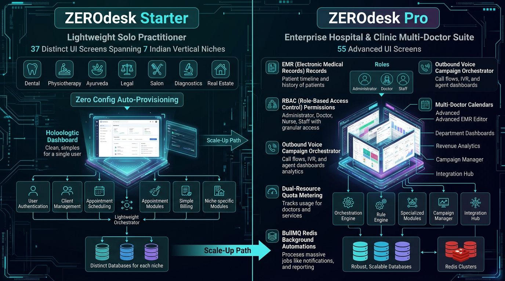
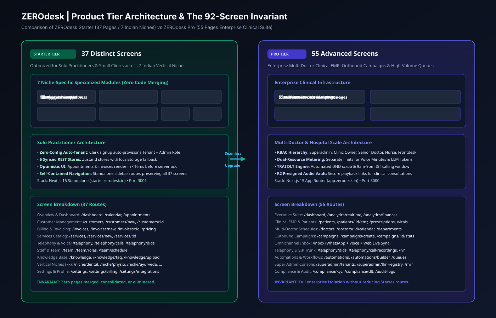
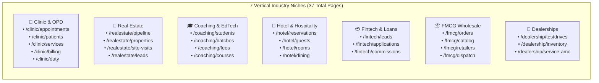

# 02. Product Tier Architecture: Starter vs. Pro

## 1. Executive Summary

ZEROdesk operates a two-tiered product architecture designed to capture both solo individual practitioners (doctors, consultants, real estate brokers) and enterprise medical organizations (multi-specialty clinics, diagnostic chains, hospital networks):

1. **ZEROdesk Starter (`0desk-starter`)**: A lightweight, high-velocity operational dashboard tailored for solo operators across 7 Indian vertical markets. It features 37 distinct dashboard screens with zero onboarding friction.
2. **ZEROdesk Pro (`apps/web`)**: A clinical-grade enterprise operations platform featuring 55 individual dashboard routes, multi-doctor scheduling, role-based access control (RBAC), statutory GST compliance, and deep Indic RAG knowledge retrieval.

---

## 2. Product Tier Separation Diagram

### 🖼️ Product Tier Architecture Infographic


### 📐 Technical 92-Screen Invariant Blueprint (SVG)


### 🗺️ Tier Architecture Flow
```mermaid
graph TD
    subgraph MarketAudience["Market Segmentation"]
        SoloUser["Solo Practitioner / Single Operator<br/>(Doctor, Broker, Tutor, Hotelier)"]
        ClinicUser["Multi-Doctor Practice / Enterprise Hospital<br/>(Medical Directors, Doctors, Receptionists, Accountants)"]
    end

    subgraph AuthLayer["Authentication & Tenant Isolation Layer"]
        ClerkUser["Clerk Authentication JWT"]
        TenantGuard["TenantGuard<br/>(apps/api/src/common/guards/tenant.guard.ts)"]
        
        ClerkUser --> TenantGuard
        SoloUser -->|Direct Solo User Login| ClerkUser
        ClinicUser -->|Clerk Organization Login| ClerkUser
        
        TenantGuard -->|No Clerk Org Detected| AutoProvision["Auto-Provision Starter Tenant<br/>(planTier: starter, role: OWNER)"]
        TenantGuard -->|Clerk Org Detected| OrgTenant["Load Enterprise Practice Tenant<br/>(planTier: pro, Multi-Role RBAC)"]
    end

    subgraph StarterApp["ZEROdesk Starter Architecture (37 Screens)"]
        direction TB
        Niches["7 Vertical Niche Engines<br/>• Clinic (8 routes)<br/>• Real Estate (5 routes)<br/>• Coaching (5 routes)<br/>• Hotel (5 routes)<br/>• Fintech (4 routes)<br/>• FMCG (5 routes)<br/>• Dealership (5 routes)"]
        
        StarterStores["Reactive Local-First Stores<br/>• customers-store.ts<br/>• appointments-store.ts<br/>• invoices-store.ts<br/>• services-store.ts<br/>• teams-store.ts<br/>• telephony-store.ts"]
        
        StarterStores --> Niches
    end

    subgraph ProApp["ZEROdesk Pro Architecture (55 Screens)"]
        direction TB
        ProModules["Enterprise Clinical Engines<br/>• Multi-Doctor Calendar (/appointments)<br/>• Unified Omnichannel Inbox (/inbox)<br/>• CRM Pipeline Stage Automations (/crm)<br/>• Indic Vector Knowledge Base (/knowledge-base)<br/>• Statutory GST Invoicing (/invoices)<br/>• Outbound Campaign Engine (/campaigns)<br/>• Superadmin Control Plane (/super-admin)"]
        
        RBAC["Role-Based Access Control<br/>• OWNER: Full Practice Governance<br/>• MANAGER: Staffing, Billing & KYC<br/>• DOCTOR: Patients, Prescriptions, Calendar<br/>• RECEPTIONIST: Check-in, Call Handling"]
        
        RBAC --> ProModules
    end

    AutoProvision --> StarterApp
    OrgTenant --> ProApp

    subgraph CommonBackend["Unified NestJS REST & Real-Time API (/v1)"]
        SharedAPI["Railway Cloud API Cluster (Port 4000)<br/>• Strict Multi-Tenant DB Query Filtering<br/>• BullMQ Redis Task Distribution<br/>• Supabase PostgreSQL (pgvector)"]
    end

    StarterApp -->|apiClient (JSON / REST)| CommonBackend
    ProApp -->|apiClient (REST + WebSockets)| CommonBackend
```

---

## 3. The Strict Invariant: Zero Page Merging

To preserve specialized user ergonomics and prevent cognitive overload, the platform strictly enforces a **Zero Page Merging Policy**:
- **Starter (37 pages)**: Every vertical niche possesses its own isolated routes (e.g. `/clinic/appointments` vs `/hotel/reservations` vs `/realestate/pipeline`). No niche concepts are combined or abstracted into generic CRUD pages.
- **Pro (55 pages)**: Every clinical operational function (inbox, calls, prescriptions, lab tests, inventory, telephony, billing, audits) lives on a dedicated, URL-addressable route.

---

## 4. Comprehensive Feature & Technical Comparison Matrix

| Feature Dimension | ZEROdesk Starter (`0desk-starter`) | ZEROdesk Pro (`apps/web`) |
| :--- | :--- | :--- |
| **Total Dashboard Routes** | **37 Individual Pages** | **55 Individual Pages** |
| **Target User Base** | Solo Practitioners, SMB Operators | Multi-Doctor Clinics, Hospitals, Enterprises |
| **Authentication Flow** | Auto-provisions practice tenant for solo Clerk user | Clerk Organizations with multi-user team invites |
| **Access Control (RBAC)** | Single-user Owner access | Granular 5-role hierarchy (Owner, Manager, Doctor, Staff, Superadmin) |
| **Telephony Integration** | Displays assigned live DID and inbound call logs | Live WebRTC monitoring, Plivo DID management, barge-in, transfer |
| **AI Receptionist** | Pre-configured Indian voice receptionist | Custom voice cloning (ElevenLabs), custom system prompts, multilingual |
| **Appointment Engine** | Single-calendar booking with auto-confirmation | Multi-doctor scheduling, chair allocation, conflict detection |
| **Knowledge Retrieval (RAG)** | Pre-indexed vertical FAQ templates | Upload PDF/DOCX, automated chunking, Indic Unicode pgvector RAG |
| **Billing & Invoicing** | Flat-rate invoices with UPI payment links | Statutory GST itemized tax invoices (CGST/SGST/IGST), soft-delete audit retention |
| **Outbound Campaigns** | N/A (Inbound receptionist only) | Full outbound dialer, WhatsApp broadcast engine, dynamic pacing |
| **State Management** | Optimistic local-first stores with REST API sync | Zustand + Server Components + WebSocket real-time event streaming |

---

## 5. Starter Tier: 7 Indian Vertical Niches & Route Architecture

Each vertical in ZEROdesk Starter is purpose-built with domain-specific terminology, workflows, and default services:



### 5.1 Solo Clerk Auto-Tenant Provisioning Code Reference
Located in [`apps/api/src/common/guards/tenant.guard.ts:16-65`](file:///c:/Users/Pc/Downloads/zerodesk/apps/api/src/common/guards/tenant.guard.ts#L16-L65):
- When a solo doctor or business owner signs up via Clerk without creating an Organization, `TenantGuard` catches the request.
- It dynamically queries PostgreSQL: if no tenant exists for `clerkUserId`, it creates a dedicated `Tenant` record with `planTier: 'starter'`, creates the `User` with `role: 'OWNER'`, and provisions an active `Subscription` record with default quotas (100 voice minutes, 500 WhatsApp messages).
- This completely eliminates onboarding drop-off.
