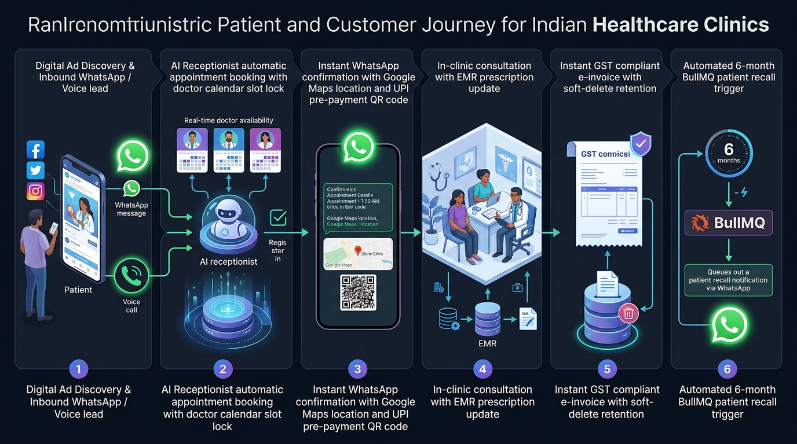
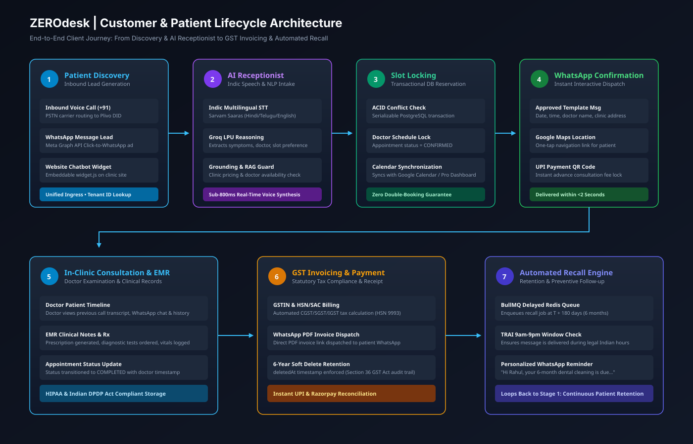
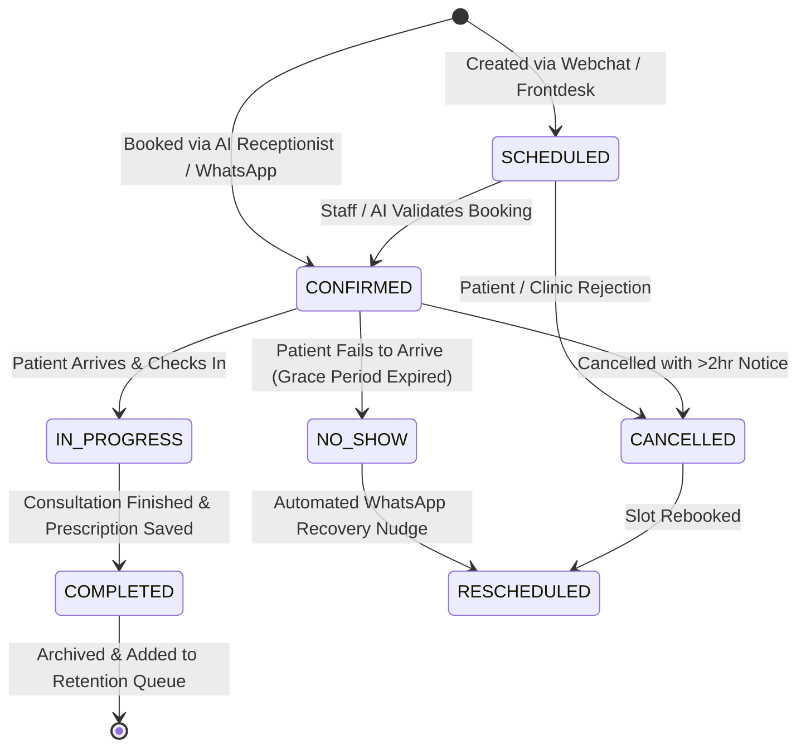
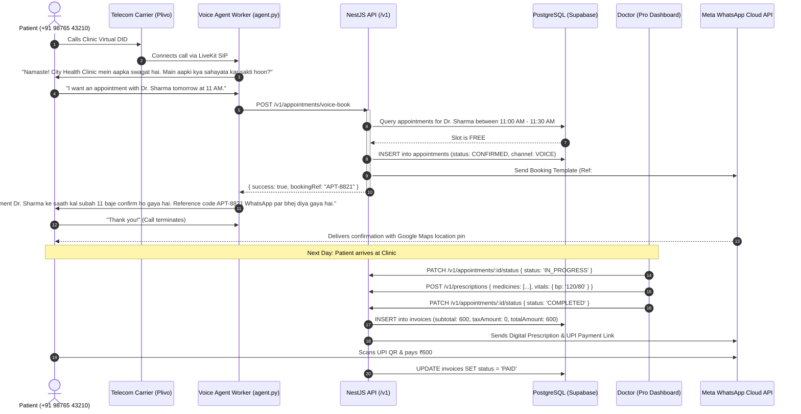

# 03. Customer Journey & Client Lifecycle Architecture

## 1. Executive Summary

The ZEROdesk customer journey architecture models the complete end-to-end lifecycle of a patient or client—from initial discovery and inbound voice intake to clinical consultation, statutory tax invoicing, and multi-month automated retention workflows.

This document details the lifecycle stages, state transition machines, sequence flows, and event-driven triggers across both digital and physical touchpoints in an Indian healthcare context.

---

## 2. End-to-End Client Lifecycle Flowchart

### 🖼️ Customer & Patient Journey Infographic

### 📐 7-Stage Client Lifecycle Vector Blueprint (SVG)

### 🗺️ Patient Lifecycle State Flow

```mermaid
flowchart TD
    subgraph Discovery["Phase 1: Discovery & Lead Ingestion"]
        AdLead["Google / Meta Ads Lead Form"]
        PhoneCall["Inbound Phone Call to Clinic DID (+91 98XXX)"]
        ChatbotLead["Website Chatbot (widget.js)"]
        WalkIn["Clinic Frontdesk Walk-in"]
    end

    subgraph Intake["Phase 2: Automated AI Intake & Triaging"]
        VoiceTriage["Voice AI Receptionist (LiveKit / agent.py)<br/>• Language Detection (Hindi, English, Telugu)<br/>• Symptoms / Inquiry Clarification"]
        WhatsAppTriage["WhatsApp AI Assistant (whatsapp-ai.listener.ts)<br/>• Natural Language Understanding<br/>• FAQ Retrieval via Indic RAG"]
    end

    Discovery --> Intake

    subgraph Booking["Phase 3: Slot Reservation & Conflict Locking"]
        PrismaLock["Prisma Transaction (appointment.service.ts)<br/>• Doctor Calendar Availability Check<br/>• Concurrent Slot Collision Locking<br/>• Creation of Appointment (Status: CONFIRMED)"]
        ConfirmMessage["Automated Instant WhatsApp Confirmation<br/>• Doctor Name & Date/Time<br/>• Clinic Google Maps Location Pin<br/>• Digital Reschedule / Cancel Button"]
    end

    Intake --> Booking

    subgraph PreVisit["Phase 4: Pre-Visit Reminders & Nudges"]
        Reminder24h["24-Hour Prior WhatsApp Reminder Nudge"]
        Reminder2h["2-Hour Prior Telephony / SMS Dispatch"]
    end

    Booking --> PreVisit

    subgraph ClinicVisit["Phase 5: Check-in & Clinical Encounter"]
        CheckIn["Receptionist Check-in (/appointments)<br/>• Patient Status: IN_PROGRESS"]
        DoctorConsult["Doctor Consultation & Diagnosis<br/>• Digital Prescription Generation<br/>• Status: COMPLETED"]
    end

    PreVisit --> ClinicVisit

    subgraph Billing["Phase 6: Invoicing & Payment Reconciliation"]
        InvoiceGen["Statutory GST Invoice Creation (/invoices)<br/>• CGST (9%) + SGST (9%) or IGST (18%)<br/>• Automated UPI QR Code Generation"]
        PaymentDone["Reconciliation (UPI / Card / Cash)<br/>• Status: PAID<br/>• WhatsApp Digital Receipt Dispatch"]
    end

    ClinicVisit --> Billing

    subgraph Retention["Phase 7: Post-Visit Retention & Automated Recalls"]
        FollowUp48h["48-Hour Recovery Follow-up (AI WhatsApp)"]
        GoogleReview["Day 7 Google Review Feedback Request"]
        Recall6m["6-Month Chronic / Preventive Health Recall (BullMQ)"]
    end

    Billing --> Retention
```

---

## 3. Appointment State Transition Machine

The lifecycle of an appointment is tracked strictly through an enum-driven finite state machine in PostgreSQL:

---

## 4. Sequence Flow: Inbound Voice Intake to Invoiced Consultation

---

## 5. Failure Scenarios & Edge Cases

| Scenario | System Behavior & Mitigation |
| :--- | :--- |
| **Doctor Unavailable at Requested Time** | The API automatically queries alternative slots for that doctor or next available specialist within the same department. The AI offers: *"Dr. Sharma is busy at 11:00 AM, but is available at 11:45 AM or Dr. Ananya is available at 11:00 AM. Which one do you prefer?"* |
| **Simultaneous Booking Collision** | Handled via Prisma transaction isolation. The second booking request encounters a conflict check and is redirected to an adjacent available slot before the voice call terminates. |
| **Call Drops Before Booking Completion** | If call drops after slot intent is recognized but before final confirmation, a BullMQ delayed job checks whether the appointment was persisted. If not, it dispatches a recovery WhatsApp message: *"We noticed your call was disconnected. Click here to confirm your 11 AM slot."* |
| **Patient Requests Rescheduling** | Handled natively via WhatsApp AI. Patient sends *"Reschedule my appointment to Friday"*; the AI identifies the booking reference, validates the new slot, updates the record, and confirms. |
