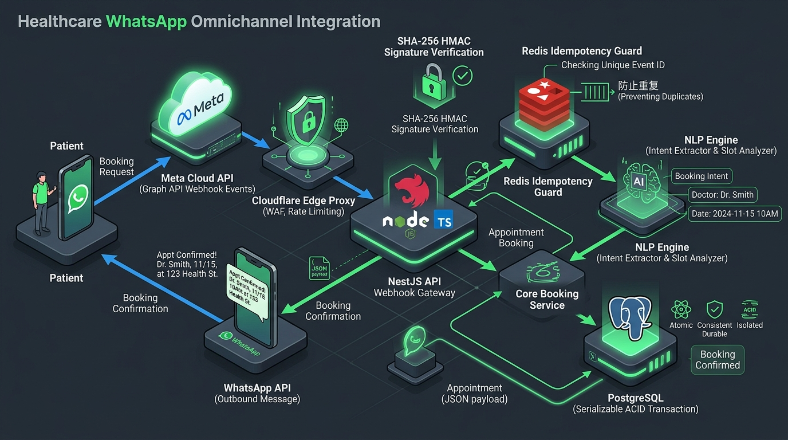
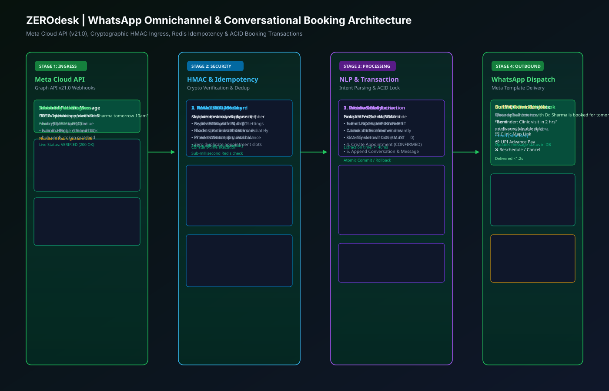
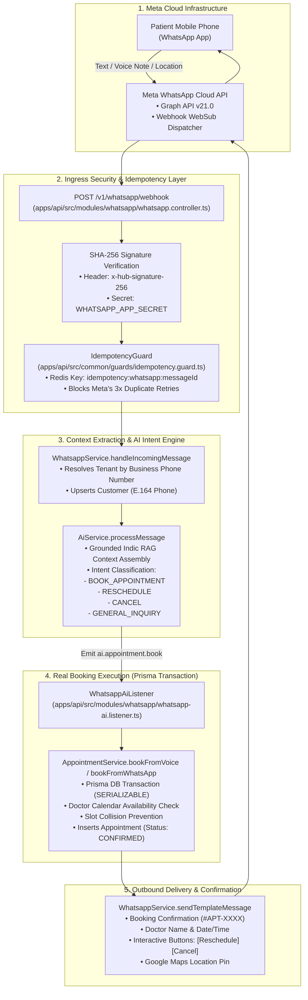
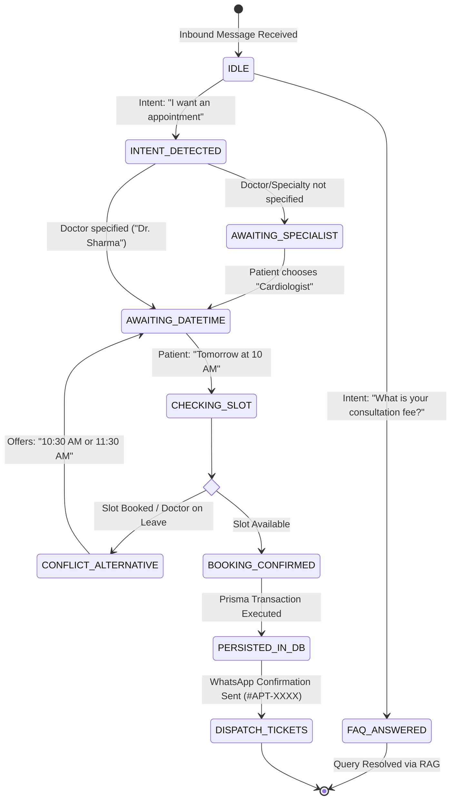

# 05. WhatsApp Omnichannel Architecture

## 1. Executive Summary

WhatsApp is the dominant communication channel for Indian healthcare and local commerce. ZEROdesk integrates natively with the **Meta WhatsApp Cloud API (Graph API v21.0)** to provide 24/7 automated appointment booking, prescription delivery, payment links, and contextual customer support in Hindi, English, and regional languages.

This document details the webhook lifecycle, cryptographic payload validation, idempotency guards, intent routing, and Prisma transaction execution.

---

## 2. WhatsApp Ingestion & Execution Pipeline

### 🖼️ WhatsApp Omnichannel Gateway Infographic

### 📐 Cryptographic HMAC & ACID Booking Vector Blueprint (SVG)

### 🗺️ Omnichannel Pipeline Graph

---

## 3. Conversational Booking State Machine

When a patient texts to book an appointment, the conversation follows a deterministic multi-turn dialogue state machine:

---

## 4. Key Implementation References

### 4.1 Idempotency Guard (Deduplication)
Located in [`apps/api/src/common/guards/idempotency.guard.ts`](file:///c:/Users/Pc/Downloads/zerodesk/apps/api/src/common/guards/idempotency.guard.ts):
- Meta WhatsApp Cloud API retries webhooks up to 3 times if an acknowledgment (`200 OK`) is not received in 5 seconds.
- `IdempotencyGuard` hashes the incoming `entry[0].changes[0].value.messages[0].id` and stores an atomic lock in Redis with a 24-hour TTL (`SET key 1 EX 86400 NX`).
- Duplicate deliveries receive an immediate `200 OK` acknowledgment without re-running the AI dialogue or creating duplicate appointments.

### 4.2 Real Booking Execution into PostgreSQL
Located in [`apps/api/src/modules/whatsapp/whatsapp-ai.listener.ts:111-145`](file:///c:/Users/Pc/Downloads/zerodesk/apps/api/src/modules/whatsapp/whatsapp-ai.listener.ts#L111-L145):
- Upon receiving `BOOK_APPOINTMENT` intent from `AiService`, `WhatsappAiListener` extracts doctor name, target date/time, customer phone, and notes.
- Executes `AppointmentService.bookFromVoice(...)` inside an atomic Prisma transaction.
- Returns a unique booking confirmation reference (e.g. `#APT-7729`) and dispatches it directly back to the patient's WhatsApp thread.

### 4.3 24-Hour Messaging Window Compliance
- **Inside 24-Hour Window**: Free-form AI conversational messages, rich interactive list pickers, and dynamic quick-reply buttons.
- **Outside 24-Hour Window**: Meta strictly enforces pre-approved HSM templates (`appointment_reminder_v1`, `prescription_ready_v1`, `payment_invoice_v1`) to prevent spam penalties and account suspension.
