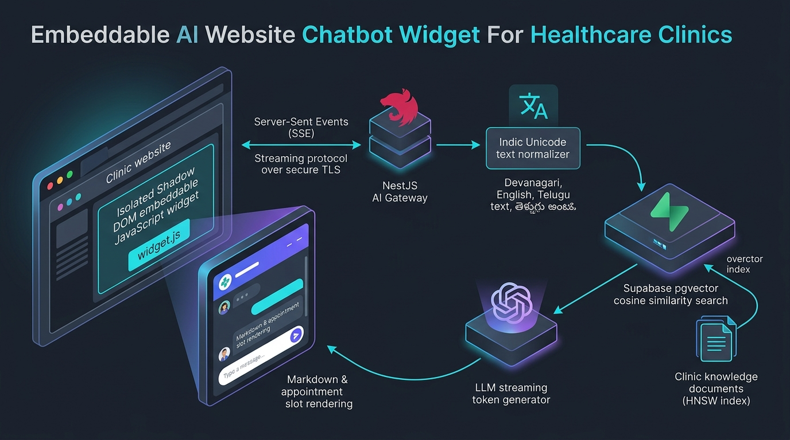
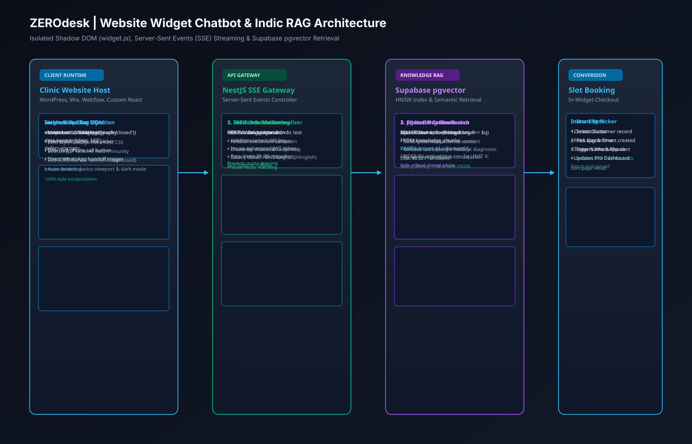
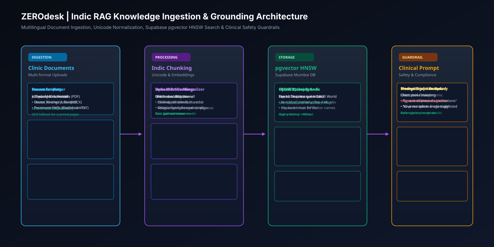
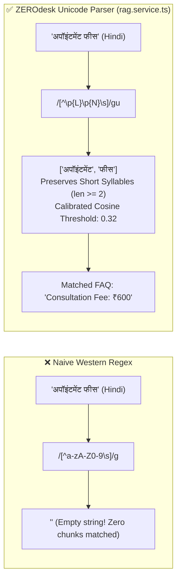

# 06. Website Widget Chatbot & In-Context RAG Architecture

## 1. Executive Summary

The ZEROdesk Website Widget is an embeddable, zero-dependency JavaScript client (`widget.js`) that mounts seamlessly onto any clinic, hospital, or commercial website. It delivers sub-second AI conversational interactions, real-time Server-Sent Events (SSE) token streaming, and grounded clinical answers powered by a multilingual Indic Vector RAG pipeline.

This document details the widget runtime, Shadow DOM encapsulation, real-time streaming transport, and the underlying pgvector Indic semantic search engine.

---

## 2. Widget Runtime & Vector RAG Architecture

### 🖼️ Embeddable Website Widget Infographic


### 📐 Shadow DOM & SSE Streaming Vector Blueprint (SVG)


### 🧠 Indic RAG Knowledge Ingestion Pipeline (SVG)


### 🗺️ Widget Runtime Flow Graph

```mermaid
flowchart TD
    subgraph ClientHost["1. Clinic Host Website (Third-Party Browser DOM)"]
        HostPage["Clinic Website HTML<br/>(e.g., cityhospital.com)"]
        ScriptTag["<script src='https://api.zerodesk.in/widget.js'<br/> data-tenant-id='...' async></script>"]
        ShadowRoot["Shadow DOM Container (#zerodesk-widget-root)<br/>• CSS Style Isolation (Zero Leaks)<br/>• Floating Chat Pill + Expanded Drawer<br/>• Mobile Responsive Viewport"]
        
        HostPage --> ScriptTag --> ShadowRoot
    end

    subgraph WidgetRuntime["2. Client Runtime & Transport Layer"]
        UserQuery["Patient / Visitor Message Input<br/>(e.g., 'What are your pediatric vaccination charges?')"]
        TransportEngine["Transport Adapter<br/>• Server-Sent Events (SSE) / WebSocket<br/>• POST /v1/chat/stream<br/>• Optimistic Message UI Display"]
        
        ShadowRoot --> UserQuery --> TransportEngine
    end

    subgraph BackendGateway["3. NestJS API Gateway (/v1/chat/stream)"]
        AuthTenant["Tenant Verification & Rate Limiter<br/>• Validates x-tenant-id<br/>• Throttles IP / Session Floods"]
        PromptGuard["PromptGuardService<br/>(apps/api/src/common/security/prompt-guard.service.ts)<br/>• Strips Prompt Injection Payloads<br/>• Boundaries Medical Advice Limits"]
        
        TransportEngine --> AuthTenant --> PromptGuard
    end

    subgraph IndicRAG["4. Indic Vector RAG Pipeline (RagService)"]
        QueryCleaner["Unicode Indic Tokenizer<br/>• Preserves Devanagari & Telugu Conjuncts<br/>• Regex: /[^\p{L}\p{N}\s]/gu<br/>• Retains Short Syllables (length >= 2)"]
        
        EmbeddingGen["OpenAI text-embedding-3-small<br/>• 1536-Dimensional Vector Generation"]
        
        VectorSearch["Supabase PostgreSQL (knowledge_chunks)<br/>• HNSW Vector Cosine Distance (<=>)<br/>• Strict Filter: WHERE tenant_id = $1<br/>• Calibrated Threshold: 0.32 (Indic) / 0.38 (Latin)"]
        
        PromptGuard --> QueryCleaner --> EmbeddingGen --> VectorSearch
    end

    subgraph LLMInference["5. Generation & Token Streaming"]
        ContextAssembler["Context Window Assembly<br/>• Injects Top-3 Retrieved Chunks<br/>• Formats Practice Pricing & Hours"]
        
        LlmStream["Groq LPU / OpenAI GPT-4o-mini<br/>• High-Speed Streaming Completion"]
        
        VectorSearch --> ContextAssembler --> LlmStream
        LlmStream -->|Chunked SSE Stream| TransportEngine
        TransportEngine -->|Typewriter Token Render| ShadowRoot
    end
```


---

## 3. Indic Script Unicode Tokenization & Calibration

A primary limitation of generic RAG systems in India is the accidental stripping of Indic vowel diacritics (*matras*) and conjuncts by naive regex parsers like `/[^a-zA-Z0-9]/g`:



### 3.1 Code Implementation Reference
Located in [`apps/api/src/modules/knowledge-base/rag.service.ts:85-175`](file:///c:/Users/Pc/Downloads/zerodesk/apps/api/src/modules/knowledge-base/rag.service.ts#L85-L175):
- Tokenizer uses Unicode property escapes: `/[^\p{L}\p{N}\s]/gu`.
- Preserves 2-letter Indic syllables (`t.length >= 2` for Devanagari, Telugu, Kannada, Tamil).
- Cosine similarity cutoff calibrated to **0.32** for Indic queries versus **0.38** for Latin queries, compensating for embedding vector dispersion across non-Latin scripts.

---

## 4. Grounding & Anti-Hallucination Controls

To prevent medical misinformation or unauthorized price discounts, the RAG engine enforces three structural guardrails:

1. **Context-Only Answering Rule**:
   The system prompt explicitly commands the model:
   ```text
   RULES:
   - Only answer using the exact medical services, timings, and prices provided in the verified context.
   - If the answer is not in the context, do NOT invent facts. Reply: "Please contact our clinic reception directly for this detail."
   - Never diagnose medical emergencies. Always advise dialing 112 or visiting the emergency room immediately.
   ```
2. **Strict Multi-Tenant Database Isolation**:
   Every vector query executes with parameter binding:
   ```sql
   SELECT content, 1 - (embedding <=> $1::vector) AS similarity
   FROM knowledge_chunks
   WHERE tenant_id = $2
   ORDER BY similarity DESC
   LIMIT 5;
   ```
   Cross-tenant vector bleeding is mathematically impossible.
3. **Interactive Booking Hand-off**:
   When the visitor expresses intent to book, the widget seamlessly displays an inline appointment slot picker without requiring page redirects.
