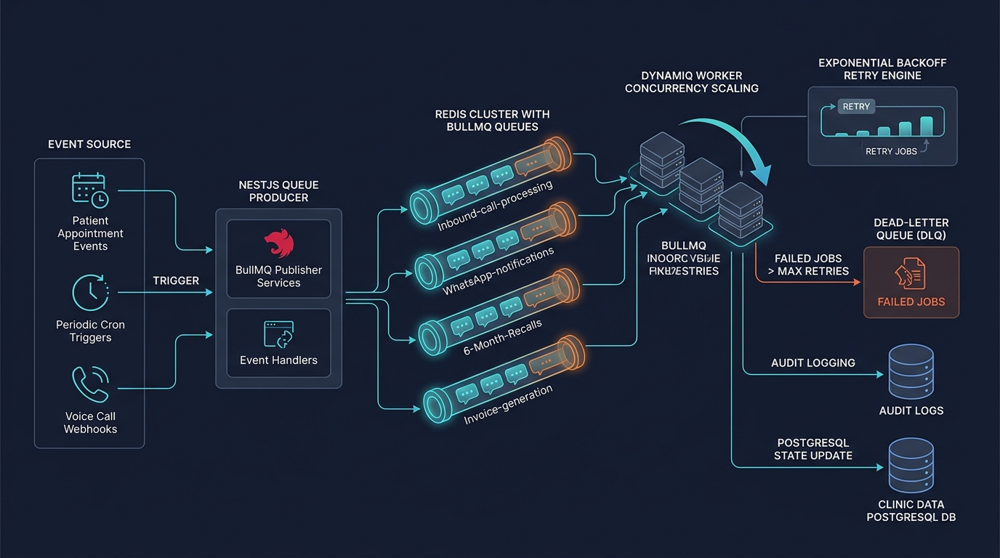
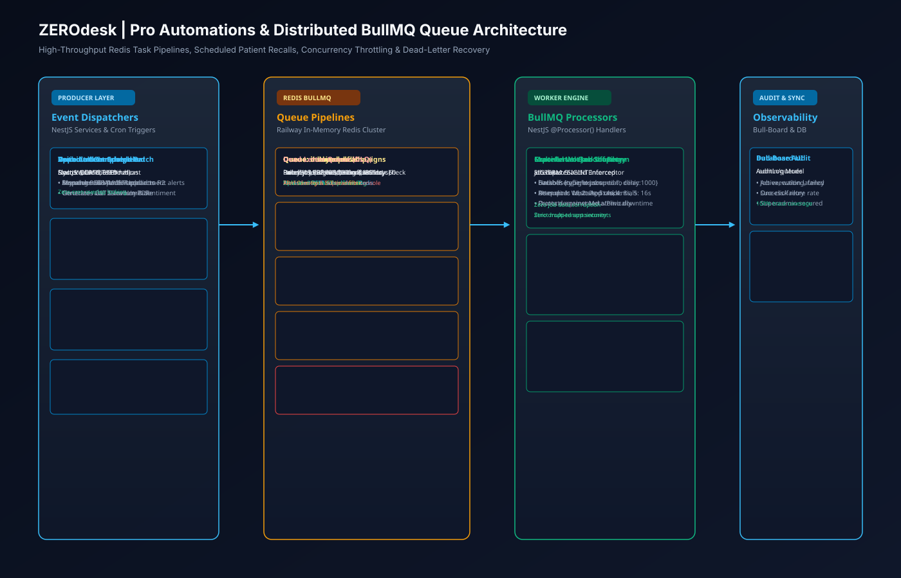
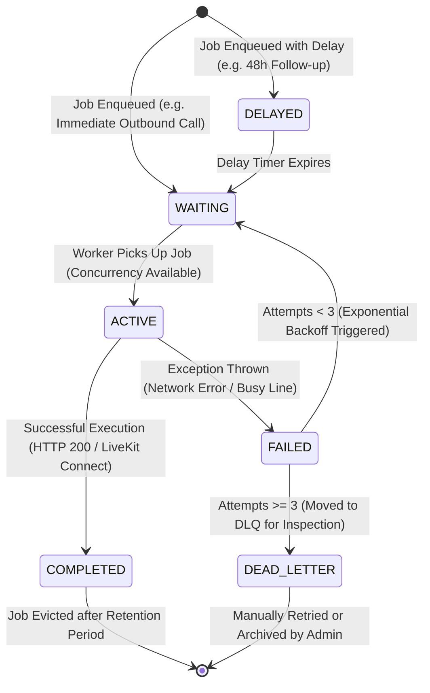

# 07. Pro Automations & BullMQ Queue Architecture

## 1. Executive Summary

ZEROdesk Pro utilizes a distributed, resilient background job architecture powered by **BullMQ** and **Redis**. It decouples synchronous HTTP request-response cycles from heavy, time-delayed asynchronous tasks such as outbound voice dispatches, post-visit WhatsApp clinical check-ins, automated no-show recoveries, and daily financial metric rollups.

This document outlines the queue topologies, worker processors, concurrency controls, retry backoff strategies, and dead-letter queue (DLQ) error recovery flows.

---

## 2. Distributed Queue Pipeline Architecture

### 🖼️ Distributed Job Processing Infographic


### 📐 BullMQ Task Distribution & DLQ Vector Blueprint (SVG)


### 🗺️ Queue Pipeline Graph
```mermaid
flowchart TD
    subgraph JobProducers["1. Event Triggers & Job Producers"]
        ConsultDone["Consultation Completed<br/>(appointments.controller.ts)"]
        NoShowEvent["Patient No-Show Detected<br/>(appointment.service.ts)"]
        CronSchedule["Cron Schedule (0 0 * * *)<br/>(Daily Rollup Aggregator)"]
        CampaignTrigger["Admin Outbound Campaign<br/>(campaign.service.ts)"]
    end

    subgraph RedisQueueCluster["2. Railway Redis BullMQ Queues"]
        QueueAutomations["Queue: 'automations'<br/>• Delayed Follow-ups (48h)<br/>• Review Requests (7d)<br/>• Retention Recalls (180d)"]
        
        QueueOutbound["Queue: 'outbound-calls'<br/>• Live Outbound Telephony Jobs<br/>• Rate-Limited Pacing"]
        
        QueueRollups["Queue: 'daily-rollups'<br/>• Tenant MRR Calculations<br/>• Call Duration Aggregations"]
        
        ConsultDone -->|schedule 48h| QueueAutomations
        NoShowEvent -->|schedule 2h| QueueAutomations
        CampaignTrigger -->|batch enqueue| QueueOutbound
        CronSchedule -->|midnight trigger| QueueRollups
    end

    subgraph WorkerProcessors["3. NestJS Background Worker Processors"]
        OutboundProcessor["OutboundCallProcessor<br/>(apps/api/src/modules/voice/outbound-call.processor.ts)<br/>• Concurrency: 5 Jobs<br/>• Plivo REST API Outbound Dial"]
        
        AutomationProcessor["AutomationProcessor<br/>• WhatsApp Template Dispatch<br/>• E.164 Contact Normalization"]
        
        RollupProcessor["RollupProcessor<br/>• Prisma DailyRollup Upsert<br/>• Metric: calls_handled, revenue"]
        
        QueueOutbound --> OutboundProcessor
        QueueAutomations --> AutomationProcessor
        QueueRollups --> RollupProcessor
    end

    subgraph ErrorHandling["4. Error Resilience & Dead-Letter Queue (DLQ)"]
        RetryLogic["Exponential Backoff Retry<br/>• Max Attempts: 3<br/>• Delay: 5s, 25s, 125s"]
        
        DLQ["Dead-Letter Queue (failed-jobs)<br/>• Alerts Admin Dashboard<br/>• Preserves Audit Context"]
        
        OutboundProcessor -->|Transient Failure (429/503)| RetryLogic
        AutomationProcessor -->|Network Drop| RetryLogic
        RetryLogic -->|Exceeded 3 Attempts| DLQ
    end
```

---

## 3. Asynchronous Job Lifecycle State Machine



---

## 4. Key Implementation References

### 4.1 Outbound Call Processor
Located in [`apps/api/src/modules/voice/outbound-call.processor.ts`](file:///c:/Users/Pc/Downloads/zerodesk/apps/api/src/modules/voice/outbound-call.processor.ts):
- Consumes jobs from queue `'outbound-calls'`.
- Injects `PlivoService` and `VoiceService`.
- Initiates carrier outbound dial with LiveKit SIP URI: `sip:call-outbound-...@sip.livekit.cloud`.
- Connects human callee directly to the AI Receptionist worker upon answering.

### 4.2 Delayed Patient Recall Scheduling
```typescript
// Enqueueing a 48-hour clinical check-in after consultation
await this.automationsQueue.add(
  'patient-followup',
  {
    tenantId,
    customerId: appointment.customerId,
    appointmentId: appointment.id,
    doctorName: appointment.staff?.name,
  },
  {
    delay: 48 * 60 * 60 * 1000, // 48 Hours in milliseconds
    attempts: 3,
    backoff: {
      type: 'exponential',
      delay: 5000,
    },
    removeOnComplete: true,
  }
);
```

### 4.3 Redis Resilience & Graceful Shutdown
- Integrated in [`apps/api/src/modules/redis/redis.service.ts`](file:///c:/Users/Pc/Downloads/zerodesk/apps/api/src/modules/redis/redis.service.ts).
- Automatically manages connection re-establishment upon Railway Redis restarts.
- Implements `beforeApplicationShutdown` hooks to pause BullMQ workers and flush active jobs before container SIGTERM terminates.
