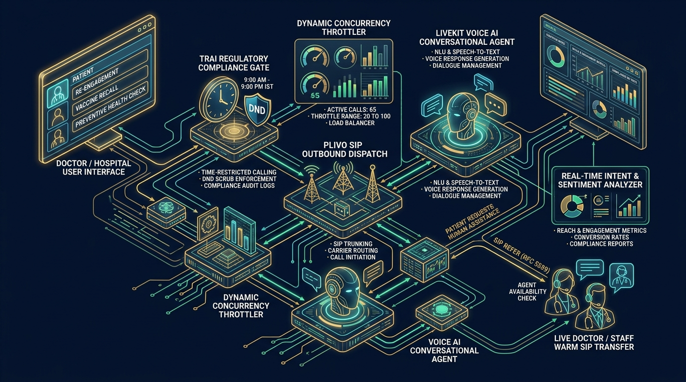
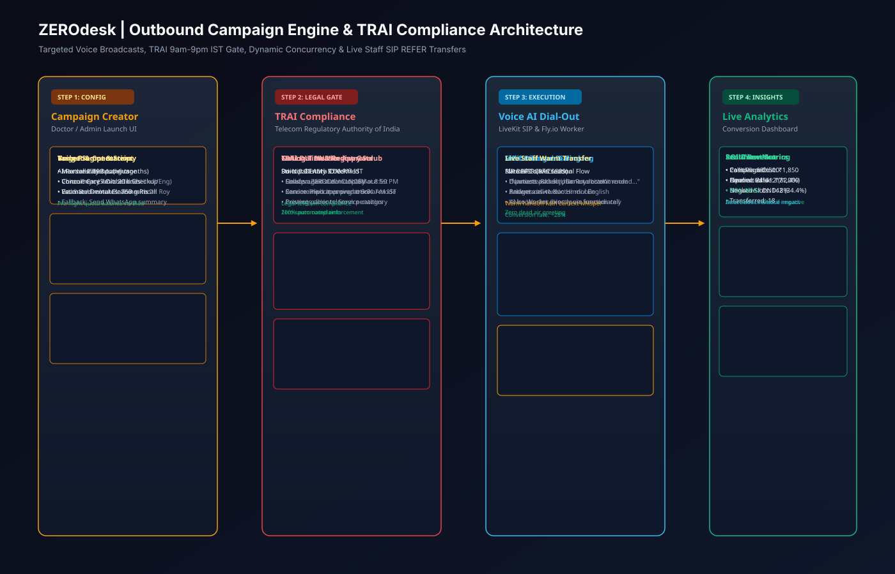
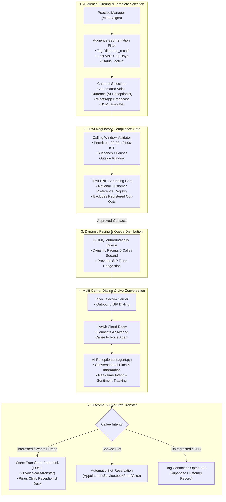
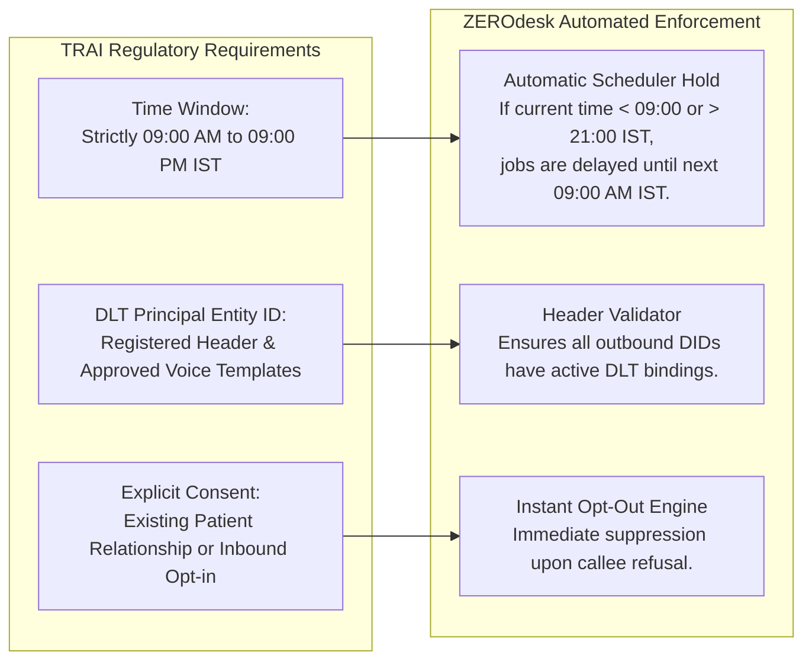

# 08. Outbound Campaign Engine & Carrier Compliance Architecture

## 1. Executive Summary

The ZEROdesk Outbound Campaign Engine enables clinics, real estate firms, and educational institutes to launch automated high-touch voice and WhatsApp outreach. It is engineered to respect Indian telecom regulations (TRAI TCCCPR), adhere strictly to permitted calling windows (9:00 AM – 9:00 PM IST), throttle outbound concurrent calls to prevent carrier line bans, and provide instant human agent transfer upon interest.

This document details audience segmentation, queue-based pacing algorithms, regulatory compliance gates, and live call conversion tracking.

---

## 2. Outbound Campaign Execution Pipeline

### 🖼️ Outbound Campaign & TRAI Compliance Infographic


### 📐 TRAI 9am-9pm Gate & SIP REFER Transfer Vector Blueprint (SVG)


### 🗺️ Campaign Pipeline Graph


---

## 3. Regulatory Compliance Architecture (TRAI TCCCPR)

In India, commercial voice calling is heavily regulated under TRAI guidelines:



---

## 4. Key Implementation References

### 4.1 Dynamic Pacing & Rate Limiting
To prevent telecom carriers from blocking practice virtual DIDs due to sudden burst traffic:
```typescript
// Rate limiting outbound jobs to 5 per second per carrier trunk
const queue = new Queue('outbound-calls', {
  connection: redisConfig,
  limiter: {
    max: 5,
    duration: 1000, // 1 second
  },
});
```

### 4.2 Automated Human Transfer Hook
Located in [`apps/voice-agent/agent.py:340-390`](file:///c:/Users/Pc/Downloads/zerodesk/apps/voice-agent/agent.py#L340-L390):
- If the callee expresses complex questions or requests a human:
```python
async def transfer_call(call_ctx: CallContext, reason: str = "Callee requested human"):
    payload = {
        "roomName": call_ctx.room_name,
        "callerPhone": call_ctx.caller_phone,
        "reason": reason,
    }
    async with aiohttp.ClientSession() as session:
        await session.post(
            f"{ZERODESK_API}/v1/voice/calls/transfer",
            json=payload,
            headers={"x-internal-voice-key": INTERNAL_VOICE_SECRET, "x-tenant-id": call_ctx.tenant_id}
        )
```
- The backend bridges the active SIP call directly to the practice's physical reception desk.
