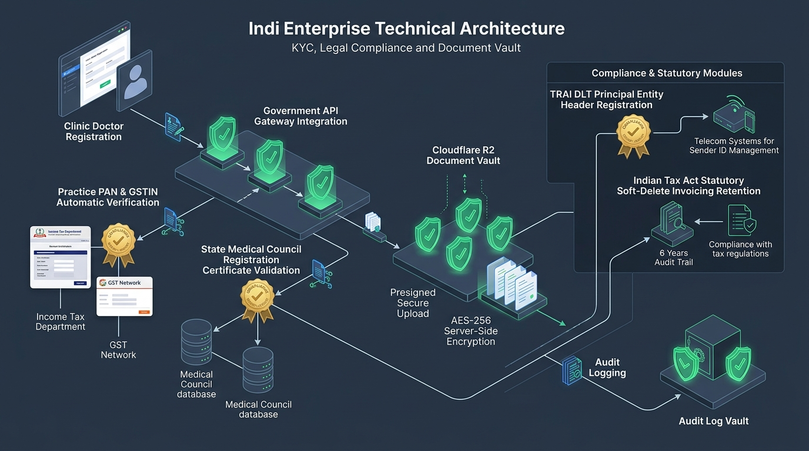
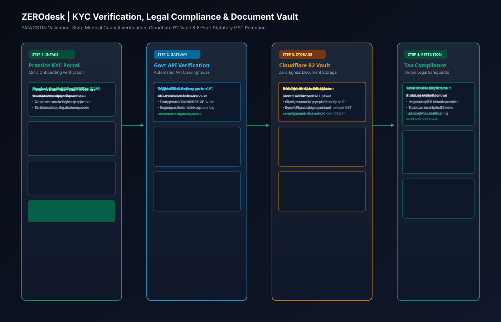
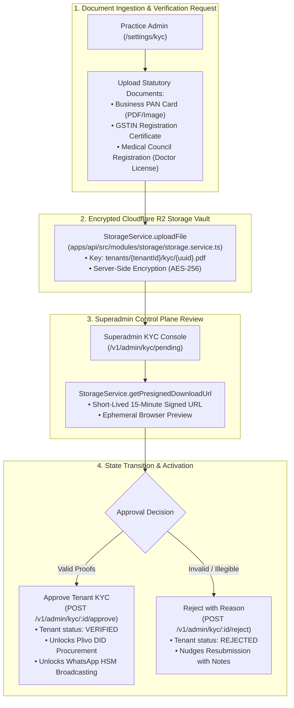
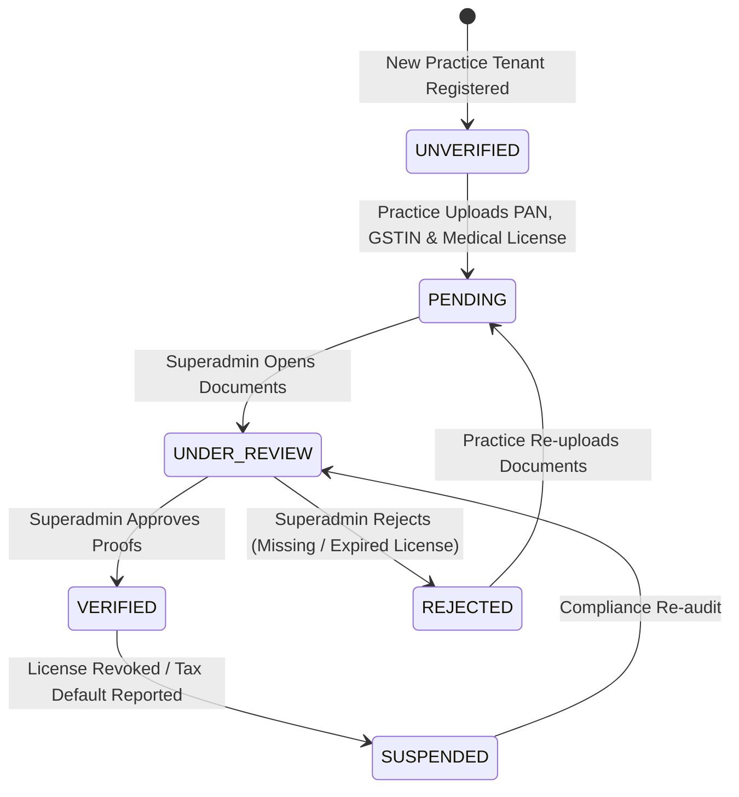

# 09. KYC Verification & Statutory Compliance Architecture

## 1. Executive Summary

ZEROdesk operates under Indian healthcare and commercial compliance regulations, including the **National Medical Commission (NMC) Registered Medical Practitioner regulations**, the **Central Goods and Services Tax (CGST) Act (Section 36)**, and **TRAI Distributed Ledger Technology (DLT) telecom mandates**.

This document outlines the practice Know-Your-Customer (KYC) onboarding pipeline, document storage encryption, statutory invoice retention, and telecom verification workflows.

---

## 2. KYC Onboarding & Verification Pipeline

### 🖼️ Practice KYC & Legal Compliance Infographic


### 📐 PAN/GSTIN Verification & R2 Vault Vector Blueprint (SVG)


### 🗺️ Compliance Pipeline Graph


---

## 3. KYC State Machine



---

## 4. Statutory Tax & Clinical Data Retention Architecture

### 4.1 6-Year GST Statutory Retention (CGST Act Section 36)
Under Indian tax law, businesses are required to maintain accounting books and tax invoices for a minimum of **72 months (6 years)** from the due date of filing the annual return.

**The Anti-Data Loss Implementation**:
- In [`apps/api/src/modules/invoice/invoice.service.ts`](file:///c:/Users/Pc/Downloads/zerodesk/apps/api/src/modules/invoice/invoice.service.ts), hard database deletions (`DELETE FROM invoices`) are **strictly prohibited**.
- The platform uses a **Soft Deletion Architecture**:
```typescript
async softDelete(tenantId: string, id: string): Promise<Invoice> {
  const existing = await this.findOne(tenantId, id);
  return this.prisma.invoice.update({
    where: { id: existing.id },
    data: { deletedAt: new Date() },
  });
}
```
- All runtime user queries filter `deletedAt: null`, while historical audit log records remain permanently preserved in PostgreSQL for statutory auditor inspection.

### 4.2 Cloudflare R2 Presigned Document Isolation
Located in [`apps/api/src/modules/storage/storage.service.ts:85-102`](file:///c:/Users/Pc/Downloads/zerodesk/apps/api/src/modules/storage/storage.service.ts#L85-L102):
- Storage keys are strictly partitioned: `tenants/${tenantId}/${folder}/${fileName}`.
- Cross-tenant document inspection is blocked at the storage service layer:
```typescript
if (!key.startsWith(`tenants/${tenantId}/`)) {
  throw new InternalServerErrorException('Access denied: file does not belong to your tenant.');
}
```
- Only short-lived URLs (expires in 900 seconds) are distributed to authenticated sessions.
