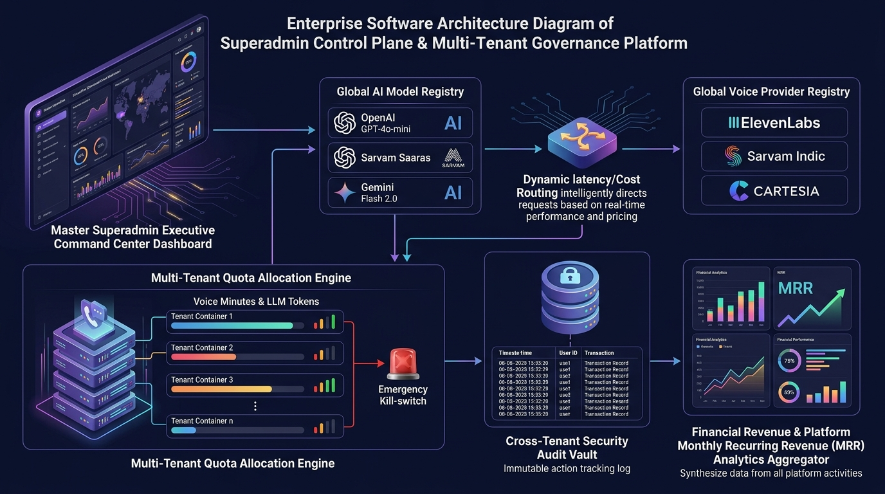
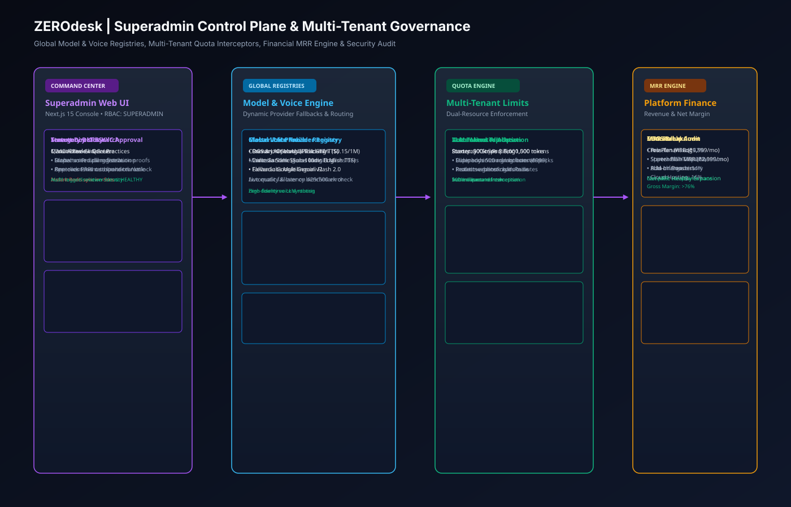
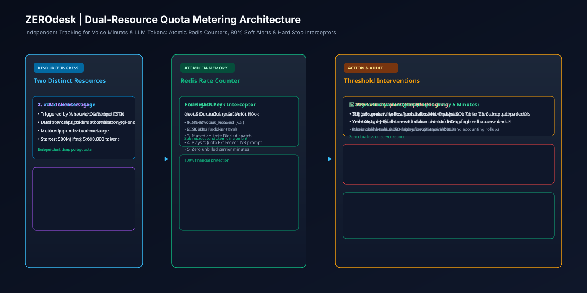
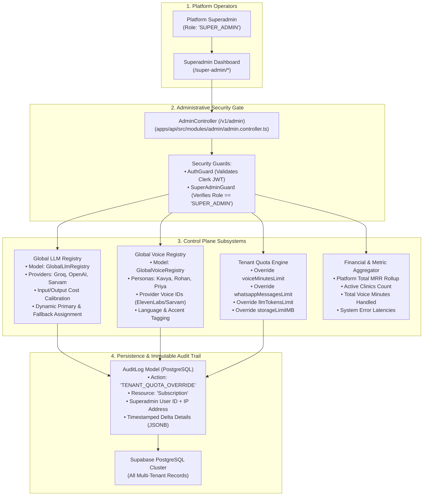
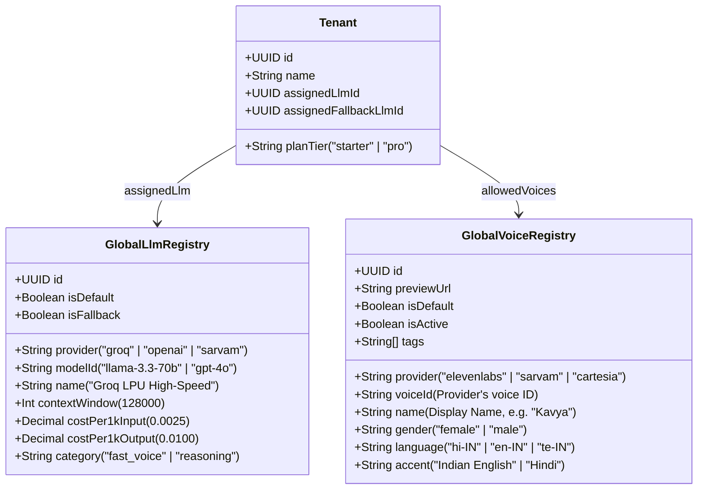

# 10. Super Admin Control Plane & Governance Architecture

## 1. Executive Summary

The ZEROdesk Super Admin Control Plane is the platform-wide governance layer used by platform operators to oversee all tenant practices, manage global AI registries (voice personas and LLM models), adjust enterprise billing quotas, and monitor platform health and MRR metrics.

This document details the administrative access controls, global model registries, multi-tenant override mechanisms, and immutable audit logging.

---

## 2. Superadmin Governance Hierarchy & Data Flow

### 🖼️ Superadmin Control Plane Infographic


### 📐 Global Model Registry & Quota Control Vector Blueprint (SVG)


### ⚖️ Dual-Resource Quota Metering Flow (SVG)


### 🗺️ Governance Pipeline Graph


---

## 3. Global AI Registries Architecture

Rather than hardcoding LLM models and voice IDs inside application code, ZEROdesk manages AI providers dynamically via platform-wide control plane registries:



---

## 4. Key Implementation References

### 4.1 Superadmin Security Guards
Located in [`apps/api/src/modules/admin/admin.controller.ts:1-25`](file:///c:/Users/Pc/Downloads/zerodesk/apps/api/src/modules/admin/admin.controller.ts#L1-L25):
- Guarded by `@UseGuards(AuthGuard, SuperAdminGuard)`.
- Rejects any unauthorized clinic doctor or staff member attempting to query administrative endpoints with `403 Forbidden`.

### 4.2 Platform Metrics Aggregation (`/v1/admin/platform/stats`)
```typescript
async getPlatformStats() {
  const [totalTenants, totalCalls, subscriptions] = await Promise.all([
    this.prisma.tenant.count({ where: { deletedAt: null } }),
    this.prisma.conversation.count({ where: { channel: 'VOICE' } }),
    this.prisma.subscription.findMany({ select: { mrr: true, voiceMinutesUsed: true } }),
  ]);

  const totalMrr = subscriptions.reduce((sum, s) => sum + Number(s.mrr || 0), 0);
  const totalMinutes = subscriptions.reduce((sum, s) => sum + (s.voiceMinutesUsed || 0), 0);

  return {
    totalTenants,
    totalCalls,
    totalMrr,
    totalMinutes,
    systemHealth: 'OPERATIONAL',
  };
}
```

### 4.3 Immutable Audit Logging
- Every administrative change (plan upgrades, quota adjustments, KYC approvals) automatically invokes `AuditLogService.logAction(...)`.
- Preserves IP address, actor user ID, target tenant ID, and payload delta in `audit_logs` table for SOC-2 and statutory compliance.
