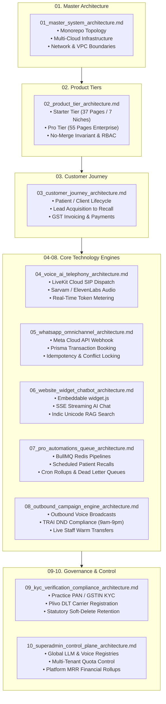

# ZEROdesk Master Architecture Documentation Suite

Welcome to the **ZEROdesk Master Architecture Repository**. This directory houses the comprehensive technical, product, and infrastructure blueprints for the entire ZEROdesk platform across **ZEROdesk Pro** and **ZEROdesk Starter**.

> [!TIP]
> **Interactive Architecture Viewer**: Open [`index.html`](./index.html) in any browser to explore the interactive visualizer with zoomable diagrams, specifications, and tabbed navigation.

---

## 🖼️ Master Cloud Infrastructure Blueprint

---

## 🗺️ Master Architecture Map

---

## 📚 Complete Document Directory & Visual Blueprints

| Document | Technical Specification | Vector SVG Diagram | High-Res Infographic |
| :--- | :--- | :--- | :--- |
| **01. Master System Architecture** | [Read Spec](./01_master_system_architecture.md) | [01 SVG](./diagrams/01_master_system_architecture.svg) | [01 JPG](./images/01_master_system_architecture.jpg) |
| **02. Product Tier Architecture** | [Read Spec](./02_product_tier_architecture.md) | [02 SVG](./diagrams/02_product_tier_architecture.svg) | [02 JPG](./images/02_product_tier_architecture.jpg) |
| **03. Customer Journey Architecture** | [Read Spec](./03_customer_journey_architecture.md) | [03 SVG](./diagrams/03_customer_journey_architecture.svg) | [03 JPG](./images/03_customer_journey_architecture.jpg) |
| **04. Voice AI & Telephony Architecture** | [Read Spec](./04_voice_ai_telephony_architecture.md) | [04 SVG](./diagrams/04_voice_ai_telephony_architecture.svg) | [04 JPG](./images/04_voice_ai_telephony_architecture.jpg) |
| **05. WhatsApp Omnichannel Architecture** | [Read Spec](./05_whatsapp_omnichannel_architecture.md) | [05 SVG](./diagrams/05_whatsapp_omnichannel_architecture.svg) | [05 JPG](./images/05_whatsapp_omnichannel_architecture.jpg) |
| **06. Website Widget Chatbot Architecture** | [Read Spec](./06_website_widget_chatbot_architecture.md) | [06 SVG](./diagrams/06_website_widget_chatbot_architecture.svg) | [06 JPG](./images/06_website_widget_chatbot_architecture.jpg) |
| **07. Pro Automations & Queue Architecture** | [Read Spec](./07_pro_automations_queue_architecture.md) | [07 SVG](./diagrams/07_pro_automations_queue_architecture.svg) | [07 JPG](./images/07_pro_automations_queue_architecture.jpg) |
| **08. Outbound Campaign Engine Architecture** | [Read Spec](./08_outbound_campaign_engine_architecture.md) | [08 SVG](./diagrams/08_outbound_campaign_engine_architecture.svg) | [08 JPG](./images/08_outbound_campaign_engine_architecture.jpg) |
| **09. KYC Verification & Compliance Architecture** | [Read Spec](./09_kyc_verification_compliance_architecture.md) | [09 SVG](./diagrams/09_kyc_verification_compliance_architecture.svg) | [09 JPG](./images/09_kyc_verification_compliance_architecture.jpg) |
| **10. Super Admin Control Plane Architecture** | [Read Spec](./10_superadmin_control_plane_architecture.md) | [10 SVG](./diagrams/10_superadmin_control_plane_architecture.svg) | [10 JPG](./images/10_superadmin_control_plane_architecture.jpg) |

### Additional Deep Technical Flow Blueprints

- **[11. Voice AI Sub-800ms Latency Budget Diagram](./diagrams/11_voice_latency_budget.svg)**: Exact millisecond transit timing breakdown from cellular tower to Groq LPU and audio return.
- **[12. Dual-Resource Quota Metering Flow Diagram](./diagrams/12_dual_resource_quota_metering.svg)**: Redis atomic counters, 80% soft cap WhatsApp alert, and 100% hard stop interceptor.
- **[13. Indic RAG Knowledge Pipeline Diagram](./diagrams/13_indic_rag_knowledge_pipeline.svg)**: Multilingual Unicode cleaning, semantic chunking, and Supabase pgvector HNSW search.

---

## 🛠️ Monorepo Codebase Navigation

The architecture documented herein corresponds to the following active production repositories:

- **Core Monorepo (`c:\Users\Pc\Downloads\zerodesk`)**:
  - `apps/api`: NestJS 11 TypeScript REST & WebSocket API, Prisma ORM, BullMQ task workers.
  - `apps/voice-agent`: LiveKit Python 3.11 voice worker with Sarvam AI, Groq LPU, and ElevenLabs.
  - `apps/web`: Next.js 15 App Router Pro dashboard (55 dashboard routes, Tailwind CSS, shadcn/ui).
  - `packages/shared`: Shared TypeScript types, validation schemas, and constants.
- **Starter Monorepo (`c:\Users\Pc\Downloads\0desk-starter`)**:
  - Next.js 15 standalone application with 37 distinct dashboard routes spanning 7 Indian industry verticals.
